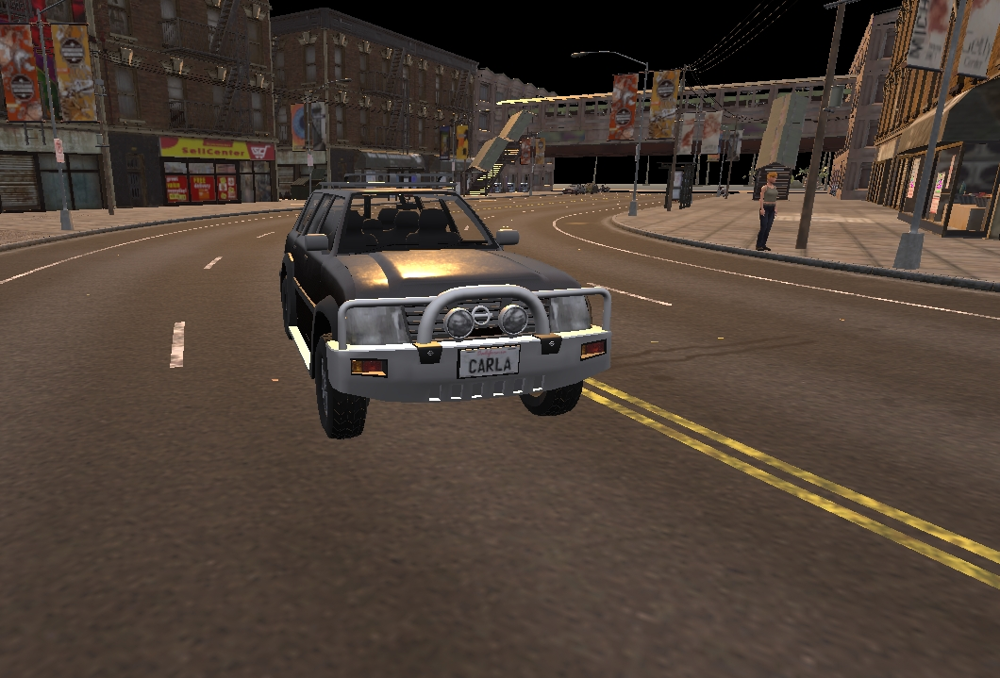

# Rendering options

This guide details the different rendering options available in CARLA, including quality levels, no-rendering mode and off-screen mode. It also explains how version 0.9.12 of CARLA differs from previous versions in these respects.

- [__Graphics quality__](#graphics-quality)  
	- [Vulkan graphics API](#vulkan-graphics-api)  
	- [Quality levels](#quality-levels)  
- [__No-rendering mode__](#no-rendering-mode)  
- [__Off-screen mode__](#off-screen-mode)  
	- [Off-screen Vs no-rendering](#off-screen-vs-no-rendering)
	- [Setting off-screen mode (Version 0.9.12+)](#setting-off-screen-mode-version-0912)
	- [Setting off-screen mode (Versions prior to 0.9.12)](#setting-off-screen-mode-versions-prior-to-0912)


!!! Important
    Some of the command options below are not equivalent in the CARLA packaged releases. Read the [Command line options](start_quickstart.md#command-line-options) section to learn more about this. 

---
## Graphics quality

### Vulkan graphics API

Starting from version 0.9.12, CARLA runs on Unreal Engine 4.26 which only supports the Vulkan graphics API. Previous versions of CARLA could be configured to use OpenGL. If you are using a previous version of CARLA, please select the corresponding documentation version in the lower right corner of the screen for more information.

### Quality levels

CARLA has two different levels for graphics quality. __Epic__  is the default and is the most detailed. __Low__ disables all post-processing and shadows and the drawing distance is set to 50m instead of infinite.

The simulation runs significantly faster in __Low__ mode. This is helpful in situations where there are technical limitations, where precision is nonessential or to train agents under conditions with simpler data or involving only close elements.

The images below compare both modes. The flag used is the same for Windows and Linux. There is no equivalent option when working with the build, but the UE editor has its own quality settings. Go to `Settings/Engine Scalability Settings` for a greater customization of the desired quality. 

#### Epic mode
`./CarlaUE4.sh -quality-level=Epic`


*Epic mode screenshot*

#### Low mode
`./CarlaUE4.sh -quality-level=Low`


*Low mode screenshot*

<br>

!!! Important
    The issue that made Epic mode show an abnormal whiteness has been fixed. If the problem persists, delete `GameUserSettings.ini`. It is saving previous settings, and will be generated again in the next run. __Ubuntu path:__ `  ~/.config/Epic/CarlaUE4/Saved/Config/LinuxNoEditor/` __Windows path:__ `<Package folder>\WindowsNoEditor\CarlaUE4\Saved\Config\WindowsNoEditor\`

---
## No-rendering mode

This mode disables rendering. Unreal Engine will skip everything regarding graphics. This mode prevents rendering overheads. It facilitates a lot traffic simulation and road behaviours at very high frequencies. To enable or disable no-rendering mode, change the world settings, or use the provided script in `/PythonAPI/util/config.py`.  

Below is an example on how to enable and then disable it via script:

```py
settings = world.get_settings()
settings.no_rendering_mode = True
world.apply_settings(settings)
...
settings.no_rendering_mode = False
world.apply_settings(settings)
```
To disable and enable rendering via the command line, run the following commands:

```sh
cd PythonAPI/util && python3 config.py --no-rendering
```
```sh
cd PythonAPI/util && python3 config.py --rendering
```

The script `PythonAPI/examples/no_rendering_mode.py` will enable no-rendering mode, and use __Pygame__ to create an aerial view using simple graphics:

```sh
cd PythonAPI/examples && python3 no_rendering_mode.py
```

!!! Warning
    In no-rendering mode, cameras and GPU sensors will return empty data. The GPU is not used. Unreal Engine is not drawing any scene. 

---
## Off-screen mode

Starting from version 0.9.12, CARLA runs on Unreal Engine 4.26 which introduced support for off-screen rendering. In previous versions of CARLA, off-screen rendering depended upon the graphics API you were using.

### Off-screen vs no-rendering

It is important to understand the distinction between __no-rendering mode__ and __off-screen mode__:

- __No-rendering mode:__ Unreal Engine does not render anything. Graphics are not computed. GPU based sensors return empty data.
- __Off-screen mode:__ Unreal Engine is working as usual, rendering is computed but there is no display available. GPU based sensors return data.

### Setting off-screen mode (Version 0.9.12+)

To start CARLA in off-screen mode, run the following command:

```sh
./CarlaUE4.sh -RenderOffScreen
```

### Setting off-screen mode (Versions prior to 0.9.12)

Using off-screen mode differs if you are using either OpenGL or Vulkan. 

__Using OpenGL__, you can run in off-screen mode in Linux by running the following command:

```sh
# Linux
DISPLAY= ./CarlaUE4.sh -opengl
```

__Vulkan__ requires extra steps because it needs to communicate to the display X server using the X11 network protocol to work properly. The following steps will guide you on how to set up an Ubuntu 18.04 machine without a display so that CARLA can run with Vulkan.

__1. Fetch the latest NVIDIA driver:__

```sh
wget http://download.nvidia.com/XFree86/Linux-x86_64/450.57/NVIDIA-Linux-x86_64-450.57.run
```

__2. Install the driver:__

```sh
sudo /bin/bash NVIDIA-Linux-x86_64-450.57.run --accept-license --no-questions --ui=none
```

__3. Install the xserver related dependencies:__

```sh
sudo apt-get install -y xserver-xorg mesa-utils libvulkan1
```

__4. Configure the xserver:__

```sh
sudo nvidia-xconfig --preserve-busid -a --virtual=1280x1024
```

__5. Set the SDL_VIDEODRIVER variable.__

```sh
ENV SDL_VIDEODRIVER=x11
```

__6. Run the xserver:__

```sh
sudo X :0 &
```

__7. Run CARLA:__

```sh
DISPLAY=:0.GPU ./CarlaUE4.sh -vulkan
```

CARLA provides a Dockerfile that performs all the above steps [here](http://github.fishros.org/https://github.com/carla-simulator/carla/blob/0.9.12/Util/Docker/Release.Dockerfile).

---

Any issues or doubts related with this topic can be posted in the CARLA forum.

<div class="build-buttons">
<p>
<a href="http://github.fishros.org/https://github.com/carla-simulator/carla/discussions/" target="_blank" class="btn btn-neutral" title="Go to the CARLA forum">
CARLA forum</a>
</p>
</div>
